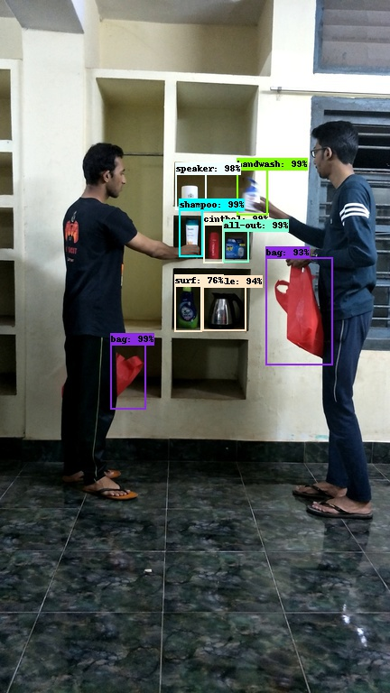
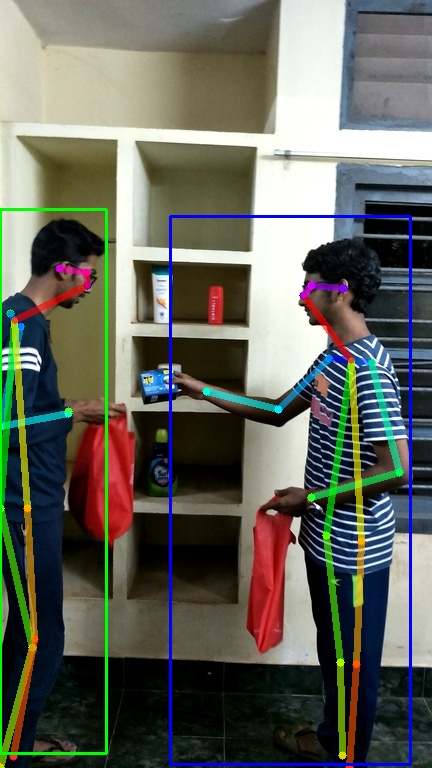
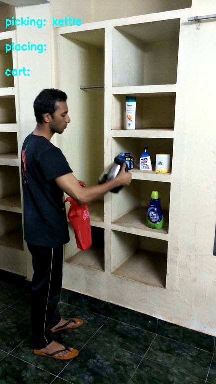

## Automated shopping using Neural networks

Use computer vision to automate billing 

<p align = 'center'>



 


 
 
</p>

    
## Project

The project comprises of three modules:

1) [Object Detection](project/object_detection/)
2) [Pose Estimation](project/pose_estimation/)
3) [Activity Detection](project/activity_detection/)

## Directory structure
    .
    ├── data
        ├── demo                        # contains demo files
        ├── frames                      # raw images
        ├── labels                      # object detection annotation data
        ├── mod-data                    # activity detection annotation data
        ├── images                      # directory for output images
        └── persondata                  # pose estimation annotation data
    ├── project    
        ├── main.py                     # the system code
        ├── activity_detection          # activity detection module code
        ├── object_detection            # object detection module code
        └── pose_estimation             # pose estimation module code
    ├── tools                           # annotation tools
    ├── requirements.txt                # pip freeze of anaconda environment
    ├── environment.yml                 # the exported anaconda environment file
    ├── Dockerfile
    └── README.md         

## Getting Started

These instructions will get you a copy of the project up and running on your local machine for development and testing purposes. 

### Prerequisites
* You need to be on Ubuntu - as Tensorflow for Python 2.7 isn't available for Windows :(

### Installing

1) Using Anaconda
* The packages are installed using Anaconda, so you need to have them installed first. Anaconda installer can be downloaded from [here](https://www.anaconda.com/distribution/#download-section)

* Clone the repository. You can do this by entering the following command in the terminal window. To open a terminal window, either right-click and select **Open terminal** or press **Ctrl+Alt+Enter**.
    ```bash
    $ git clone git@github.com:nabhanabdulla/MLabs.git
    ```
* Change directory to the clone folder
    ```bash
    $ cd MLabs
    ```
* Now, type this command to create a new anaconda environment with the dependencies for this repo
    ```bash
    $ conda env create -f environment.yml
    ```
* Activate the environment
     ```bash
    $ conda activate MLabs-cpu
    ```
    
* Download the pose estimation model from [here](https://drive.google.com/open?id=1oMOmpI9C_PT6fNbo0Zk2j_4GDK2Dq09x).

* Now, type this command to go to directory where the downloaded model should be placed.
    ```bash
    $ cd project/pose_estimation/model
    ```
* Place the downloaded model in the current directory.

* To try running the project, goto the projects folder
    ```bash
    $ cd ../..
    $ pwd
    /home/username/**some-directories**/MLabs/project
    $ python main.py
    ```

<!---
2) Using Docker 
* Install and setup Docker using info [here](https://docs.docker.com/install/linux/docker-ce/ubuntu/)
* Get the docker image
    ```bash
    $ sudo docker run nabhanpv/automated-shopping-experience
    ```
* On completion of installation of libraries, you will be displayed the bash shell of the docker container. Here you can play with the files as you would normally.
-->

## Authors

* **Karthik** - [automated_shopping_experience](https://github.com/gottacodeemall/automated_shopping_experience)
* **Hemanth**
* **Abin**


## Acknowledgments
* MLabs 
